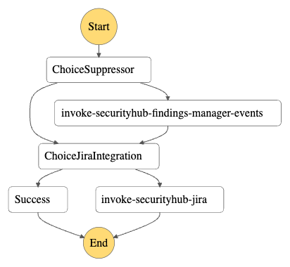

# Security Hub Findings Manager

Automated scanning and finding consolidation are essential for evaluating your security posture. AWS Security Hub is the native solution for this task within AWS. The number of findings it generates can initially be overwhelming. Additionally, some findings may be irrelevant or have less urgency for your specific situation.

The Security Hub Findings Manager is a framework designed to automatically manage findings recorded by AWS Security Hub, including its [AWS service integrations](https://docs.aws.amazon.com/securityhub/latest/userguide/securityhub-internal-providers.html#internal-integrations-summary), based on a configurable rules list. Its primary aim is to reduce noise and help you prioritize genuine security issues.

## Supported Functionality

* Suppressing findings to manage irrelevant or less urgent issues effectively.
* Automated ticket creation in Jira and ServiceNow for non-suppressed findings exceeding a customizable severity threshold.

> [!TIP]
> Deploy this module in the Audit/Security Account of an AWS reference multi-account setup. This setup receives events from all child accounts, providing a comprehensive overview of the organization's security posture.

> [!IMPORTANT]
> This module relies heavily on [awsfindingsmanagerlib](https://github.com/schubergphilis/awsfindingsmanagerlib/tree/main). For detailed suppression logic information, refer to the library's [documentation](https://awsfindingsmanagerlib.readthedocs.io/en/latest/).

## Components

Here's a high-level overview of the components. For more details, see [Resources](#resources) and [Modules](#modules).

* Rules backend (currently only S3 supported).
* Three Lambda Functions:
  * Security Hub Findings Manager Events: triggered by EventBridge for new Security Hub findings.
  * Security Hub Findings Manager Triggers: responds to changes in the S3 backend rules list, putting suppression rules on SQS.
  * Security Hub Findings Manager Trigger Worker: activated by suppression rules on SQS.
* Infrastructure supporting Lambda functions (IAM role, EventBridge integration, S3 Trigger Notifications, SQS queue).
* Optional Jira integration components.
* Optional ServiceNow integration components.

## Formatting the `rules.yaml` File

An example file is available under `examples/rules.yaml`. For detailed information, see the Rule Syntax section in the [awsfindingsmanagerlib documentation](https://awsfindingsmanagerlib.readthedocs.io/en/latest/#rule-syntax).

## Deployment Modes

Three deployment modes are available:

> [!IMPORTANT]
> During the first deployment, be aware that S3 triggers might take time to become fully functional. Re-create the rules object later to apply rules to your findings history.

### Default (Without Jira & ServiceNow Integration)

Deploys two Lambda functions:

* `securityhub-findings-manager-events`: target for the EventBridge rule `Security Hub Findings - Imported` events.
* `securityhub-findings-manager-trigger`: target for the S3 PutObject trigger.

### With Jira Integration

* **Orchestrated Jira ticketing**: Deploys an additional Jira lambda function and a Step function for orchestration, triggered by an EventBridge rule. Non-suppressed findings with severity above a threshold result in ticket creation and workflow status update from `NEW` to `NOTIFIED`.
* **Multiple Jira Instances**: Supports routing findings to different Jira projects based on AWS account IDs. Each AWS account is routed to exactly one Jira instance. Supports a default instance as fallback for unmatched accounts.
* **ProductName Filtering**:  Optionally restrict ticket creation to specific AWS products using `jira_integration.include_product_names` (`default = []`, meaning all products). For example, `["Security Hub"]`, `["Inspector"]`, `["GuardDuty"]`, or `["Macie"]`. Filtering is implemented at the Step Function level for optimal performance and applies globally to all Jira instance configurations.
* **Global severity threshold:**: Only findings with a normalized severity level above the threshold (default `70`) initiate Jira integration. This threshold applies to all Jira instance configurations.

[Normalized severity levels](https://docs.aws.amazon.com/securityhub/1.0/APIReference/API_Severity.html):

* `0` - INFORMATIONAL
* `1–39` - LOW
* `40–69` - MEDIUM
* `70–89` - HIGH
* `90–100` - CRITICAL

#### Enable automatic ticket closure

* **Global auto-closing:** Enable automatic ticket closure with `jira_integration.autoclose_enabled` (`default = false`). Based on the issue key stored in the finding note, the function transitions issues using `jira_integration.autoclose_transition_name` and adds `jira_integration.autoclose_comment`. Autoclose settings apply globally across all configured Jira instances.
* **Suppressed findings auto-closing:** Enable automatic ticket closure for suppressed findings with `jira_integration.autoclose_suppressed_findings` (`default = false`). When enabled, findings with Workflow Status `"SUPPRESSED"` will trigger automatic ticket closure.
* **Per-instance intermediate transition:**: Optionally specify `jira_integration.instances.<name>.include_intermediate_transition` to transition the ticket through an intermediate status before closing it. This is useful for Jira workflows that require tickets to pass through specific statuses (e.g., `"Review"`, `"In Progress"`) before reaching the final closed state. If not specified, tickets are closed directly using `autoclose_transition_name`. This setting is defined per Jira instance.
* **Closure criteria**: Criteria for being forwarded for automatic ticket closure are:
  * Workflow Status "RESOLVED"
  * Workflow Status "SUPPRESSED" (when `jira_integration.autoclose_suppressed_findings = true`)
  * Workflow Status "NOTIFIED" and one of:
    * Record State "ARCHIVED"
    * Compliance State "PASSED" or "NOT_AVAILABLE"

### With ServiceNow Integration

[Reference design](https://aws.amazon.com/blogs/security/how-to-set-up-two-way-integration-between-aws-security-hub-and-servicenow)

* Enable by setting the variable `servicenow_integration` to `true` (default = false).
* Deploys resources supporting ServiceNow integration, including an SQS Queue, EventBridge Rule, and required IAM user.
* EventBridge triggers events for Security Hub, placing them on an SQS Queue.
* Configure which findings are forwarded via `severity_label_filter`.
* ServiceNow retrieves events from the SQS queue using `SCSyncUser` credentials.

> [!WARNING]
> Generate the `access_key` & `secret_access_key` in the AWS Console. If you prefer Terraform to handle this (and output them), set the variable `create_servicenow_access_keys` to `true` (default = false).

## Local Development on Python Code

A lambda layer provides aws-lambda-powertools. To have these dependencies locally, use `requirements-dev.txt` from the source code.

<!-- BEGIN_TF_DOCS -->
## Requirements

| Name | Version |
|------|---------|
|  [terraform](#requirement\_terraform) | >= 1.7.0 |
|  [archive](#requirement\_archive) | >= 2.0 |
|  [aws](#requirement\_aws) | >= 4.9 |
|  [external](#requirement\_external) | >= 2.0 |
|  [local](#requirement\_local) | >= 1.0 |
|  [null](#requirement\_null) | >= 2.0 |

## Providers

| Name | Version |
|------|---------|
|  [aws](#provider\_aws) | >= 4.9 |

## Modules

| Name | Source | Version |
|------|--------|---------|
|  [findings\_manager\_bucket](#module\_findings\_manager\_bucket) | schubergphilis/mcaf-s3/aws | ~> 0.14.1 |
|  [findings\_manager\_events\_lambda](#module\_findings\_manager\_events\_lambda) | schubergphilis/mcaf-lambda/aws | ~> 1.4.1 |
|  [findings\_manager\_trigger\_lambda](#module\_findings\_manager\_trigger\_lambda) | schubergphilis/mcaf-lambda/aws | ~> 1.4.1 |
|  [findings\_manager\_worker\_lambda](#module\_findings\_manager\_worker\_lambda) | schubergphilis/mcaf-lambda/aws | ~> 1.4.1 |
|  [jira\_eventbridge\_iam\_role](#module\_jira\_eventbridge\_iam\_role) | schubergphilis/mcaf-role/aws | ~> 0.3.2 |
|  [jira\_lambda](#module\_jira\_lambda) | schubergphilis/mcaf-lambda/aws | ~> 1.4.1 |
|  [jira\_step\_function\_iam\_role](#module\_jira\_step\_function\_iam\_role) | schubergphilis/mcaf-role/aws | ~> 0.3.2 |
|  [servicenow\_integration](#module\_servicenow\_integration) | ./modules/servicenow/ | n/a |

## Resources

| Name | Type |
|------|------|
| [aws_cloudwatch_event_rule.securityhub_findings_events](https://registry.terraform.io/providers/hashicorp/aws/latest/docs/resources/cloudwatch_event_rule) | resource |
| [aws_cloudwatch_event_rule.securityhub_findings_resolved_events](https://registry.terraform.io/providers/hashicorp/aws/latest/docs/resources/cloudwatch_event_rule) | resource |
| [aws_cloudwatch_event_target.findings_manager_events_lambda](https://registry.terraform.io/providers/hashicorp/aws/latest/docs/resources/cloudwatch_event_target) | resource |
| [aws_cloudwatch_event_target.jira_orchestrator](https://registry.terraform.io/providers/hashicorp/aws/latest/docs/resources/cloudwatch_event_target) | resource |
| [aws_cloudwatch_event_target.jira_orchestrator_resolved](https://registry.terraform.io/providers/hashicorp/aws/latest/docs/resources/cloudwatch_event_target) | resource |
| [aws_cloudwatch_log_group.log_group_jira_orchestrator_sfn](https://registry.terraform.io/providers/hashicorp/aws/latest/docs/resources/cloudwatch_log_group) | resource |
| [aws_lambda_event_source_mapping.sqs_to_worker](https://registry.terraform.io/providers/hashicorp/aws/latest/docs/resources/lambda_event_source_mapping) | resource |
| [aws_lambda_permission.eventbridge_invoke_findings_manager_events_lambda](https://registry.terraform.io/providers/hashicorp/aws/latest/docs/resources/lambda_permission) | resource |
| [aws_lambda_permission.s3_invoke_findings_manager_trigger_lambda](https://registry.terraform.io/providers/hashicorp/aws/latest/docs/resources/lambda_permission) | resource |
| [aws_s3_bucket_notification.findings_manager_trigger](https://registry.terraform.io/providers/hashicorp/aws/latest/docs/resources/s3_bucket_notification) | resource |
| [aws_s3_object.findings_manager_lambdas_deployment_package](https://registry.terraform.io/providers/hashicorp/aws/latest/docs/resources/s3_object) | resource |
| [aws_s3_object.jira_lambda_deployment_package](https://registry.terraform.io/providers/hashicorp/aws/latest/docs/resources/s3_object) | resource |
| [aws_s3_object.rules](https://registry.terraform.io/providers/hashicorp/aws/latest/docs/resources/s3_object) | resource |
| [aws_sfn_state_machine.jira_orchestrator](https://registry.terraform.io/providers/hashicorp/aws/latest/docs/resources/sfn_state_machine) | resource |
| [aws_sqs_queue.dlq_for_findings_manager_rule_q](https://registry.terraform.io/providers/hashicorp/aws/latest/docs/resources/sqs_queue) | resource |
| [aws_sqs_queue.findings_manager_rule_q](https://registry.terraform.io/providers/hashicorp/aws/latest/docs/resources/sqs_queue) | resource |
| [aws_sqs_queue_policy.findings_manager_rule_sqs_policy](https://registry.terraform.io/providers/hashicorp/aws/latest/docs/resources/sqs_queue_policy) | resource |
| [aws_sqs_queue_redrive_allow_policy.dead_letter_allow_policy](https://registry.terraform.io/providers/hashicorp/aws/latest/docs/resources/sqs_queue_redrive_allow_policy) | resource |
| [aws_sqs_queue_redrive_policy.redrive_policy](https://registry.terraform.io/providers/hashicorp/aws/latest/docs/resources/sqs_queue_redrive_policy) | resource |
| [aws_caller_identity.current](https://registry.terraform.io/providers/hashicorp/aws/latest/docs/data-sources/caller_identity) | data source |
| [aws_iam_policy_document.findings_manager_lambda_iam_role](https://registry.terraform.io/providers/hashicorp/aws/latest/docs/data-sources/iam_policy_document) | data source |
| [aws_iam_policy_document.findings_manager_rule_sqs_policy_doc](https://registry.terraform.io/providers/hashicorp/aws/latest/docs/data-sources/iam_policy_document) | data source |
| [aws_iam_policy_document.jira_eventbridge_iam_role](https://registry.terraform.io/providers/hashicorp/aws/latest/docs/data-sources/iam_policy_document) | data source |
| [aws_iam_policy_document.jira_lambda_iam_role](https://registry.terraform.io/providers/hashicorp/aws/latest/docs/data-sources/iam_policy_document) | data source |
| [aws_iam_policy_document.jira_step_function_iam_role](https://registry.terraform.io/providers/hashicorp/aws/latest/docs/data-sources/iam_policy_document) | data source |
| [aws_region.current](https://registry.terraform.io/providers/hashicorp/aws/latest/docs/data-sources/region) | data source |

## Inputs

| Name | Description | Type | Default | Required |
|------|-------------|------|---------|:--------:|
|  [kms\_key\_arn](#input\_kms\_key\_arn) | The ARN of the KMS key used to encrypt the resources | `string` | n/a | yes |
|  [s3\_bucket\_name](#input\_s3\_bucket\_name) | The name for the S3 bucket which will be created for storing the function's deployment package | `string` | n/a | yes |
|  [findings\_manager\_events\_lambda](#input\_findings\_manager\_events\_lambda) | Findings Manager Lambda settings - Manage Security Hub findings in response to EventBridge events | <pre>object({     name        = optional(string, "securityhub-findings-manager-events")     log_level   = optional(string, "ERROR")     memory_size = optional(number, 256)     timeout     = optional(number, 300)      security_group_egress_rules = optional(list(object({       cidr_ipv4                    = optional(string)       cidr_ipv6                    = optional(string)       description                  = string       from_port                    = optional(number, 0)       ip_protocol                  = optional(string, "-1")       prefix_list_id               = optional(string)       referenced_security_group_id = optional(string)       to_port                      = optional(number, 0)     })), [])   })</pre> | `{}` | no |
|  [findings\_manager\_trigger\_lambda](#input\_findings\_manager\_trigger\_lambda) | Findings Manager Lambda settings - Manage Security Hub findings in response to S3 file upload triggers | <pre>object({     name        = optional(string, "securityhub-findings-manager-trigger")     log_level   = optional(string, "ERROR")     memory_size = optional(number, 256)     timeout     = optional(number, 300)      security_group_egress_rules = optional(list(object({       cidr_ipv4                    = optional(string)       cidr_ipv6                    = optional(string)       description                  = string       from_port                    = optional(number, 0)       ip_protocol                  = optional(string, "-1")       prefix_list_id               = optional(string)       referenced_security_group_id = optional(string)       to_port                      = optional(number, 0)     })), [])   })</pre> | `{}` | no |
|  [findings\_manager\_worker\_lambda](#input\_findings\_manager\_worker\_lambda) | Findings Manager Lambda settings - Manage Security Hub findings in response to SQS trigger | <pre>object({     name        = optional(string, "securityhub-findings-manager-worker")     log_level   = optional(string, "ERROR")     memory_size = optional(number, 256)     timeout     = optional(number, 900)      security_group_egress_rules = optional(list(object({       cidr_ipv4                    = optional(string)       cidr_ipv6                    = optional(string)       description                  = string       from_port                    = optional(number, 0)       ip_protocol                  = optional(string, "-1")       prefix_list_id               = optional(string)       referenced_security_group_id = optional(string)       to_port                      = optional(number, 0)     })), [])   })</pre> | `{}` | no |
|  [jira\_eventbridge\_iam\_role\_name](#input\_jira\_eventbridge\_iam\_role\_name) | The name of the role which will be assumed by EventBridge rules for Jira integration | `string` | `"SecurityHubFindingsManagerJiraEventBridge"` | no |
|  [jira\_integration](#input\_jira\_integration) | Findings Manager - Jira integration settings | <pre>object({     # Global settings for all jira instances     autoclose_comment                     = optional(string, "Security Hub finding has been resolved. Autoclosing the issue.")     autoclose_enabled                     = optional(bool, false)     autoclose_suppressed_findings         = optional(bool, false)     autoclose_transition_name             = optional(string, "Close Issue")     exclude_account_ids                   = optional(list(string), [])     finding_severity_normalized_threshold = optional(number, 70)     include_product_names                 = optional(list(string), [])      security_group_egress_rules = optional(list(object({       cidr_ipv4                    = optional(string)       cidr_ipv6                    = optional(string)       description                  = string       from_port                    = optional(number, 0)       ip_protocol                  = optional(string, "-1")       prefix_list_id               = optional(string)       referenced_security_group_id = optional(string)       to_port                      = optional(number, 0)     })), [])      lambda_settings = optional(object({       name        = optional(string, "securityhub-findings-manager-jira")       log_level   = optional(string, "ERROR")       memory_size = optional(number, 256)       timeout     = optional(number, 60)     }), {})      step_function_settings = optional(object({       log_level = optional(string, "ERROR")       retention = optional(number, 90)     }), {})      # Per-instance configurations     instances = optional(map(object({       enabled                         = optional(bool, true)       credentials_secretsmanager_arn  = optional(string)       credentials_ssm_secret_arn      = optional(string)       default_instance                = optional(bool, false)       include_account_ids             = optional(list(string), [])       include_intermediate_transition = optional(string)       issue_custom_fields             = optional(map(string), {})       issue_type                      = optional(string, "Security Advisory")       project_key                     = string     })), {})   })</pre> | `null` | no |
|  [jira\_step\_function\_iam\_role\_name](#input\_jira\_step\_function\_iam\_role\_name) | The name of the role which will be assumed by AWS Step Function for Jira integration | `string` | `"SecurityHubFindingsManagerJiraStepFunction"` | no |
|  [lambda\_runtime](#input\_lambda\_runtime) | The version of Python to use for the Lambda functions | `string` | `"python3.12"` | no |
|  [rules\_filepath](#input\_rules\_filepath) | Pathname to the file that stores the manager rules | `string` | `""` | no |
|  [rules\_s3\_object\_name](#input\_rules\_s3\_object\_name) | The S3 object containing the rules to be applied to Security Hub findings manager | `string` | `"rules.yaml"` | no |
|  [servicenow\_integration](#input\_servicenow\_integration) | ServiceNow integration settings | <pre>object({     enabled                   = optional(bool, false)     create_access_keys        = optional(bool, false)     cloudwatch_retention_days = optional(number, 365)     severity_label_filter     = optional(list(string), [])   })</pre> | <pre>{   "enabled": false }</pre> | no |
|  [subnet\_ids](#input\_subnet\_ids) | The subnet ids where the Lambda functions needs to run | `list(string)` | `null` | no |
|  [tags](#input\_tags) | A mapping of tags to assign to the resources | `map(string)` | `{}` | no |

## Outputs

| Name | Description |
|------|-------------|
|  [findings\_manager\_events\_lambda\_sg\_id](#output\_findings\_manager\_events\_lambda\_sg\_id) | This will output the security group id attached to the lambda\_findings\_manager\_events Lambda. This can be used to tune ingress and egress rules. |
|  [findings\_manager\_trigger\_lambda\_sg\_id](#output\_findings\_manager\_trigger\_lambda\_sg\_id) | This will output the security group id attached to the lambda\_findings\_manager\_trigger Lambda. This can be used to tune ingress and egress rules. |
|  [findings\_manager\_worker\_lambda\_sg\_id](#output\_findings\_manager\_worker\_lambda\_sg\_id) | This will output the security group id attached to the lambda\_findings\_manager\_worker Lambda. This can be used to tune ingress and egress rules. |
|  [jira\_lambda\_sg\_id](#output\_jira\_lambda\_sg\_id) | This will output the security group id attached to the jira\_lambda Lambda. This can be used to tune ingress and egress rules. |
<!-- END_TF_DOCS -->
